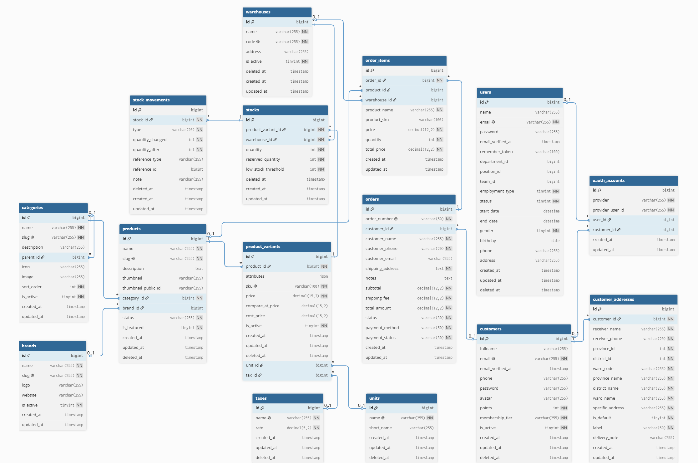

# E-commerce Platform

An e-commerce platform with product management, shopping cart, order processing, authentication, authorization, shipping integration, and payment processing.

**Website:** [ecommerce.giahuy.tech](https://ecommerce.giahuy.tech)  

## Tech Stack

- **Backend:** Laravel, RESTful API, JWT, OAuth 2.0
- **Frontend:** Vue.js, Tailwind CSS, scss
- **Database & Storage:** MySQL, Redis
- **Async Processing:** Queue, Mail Queue
- **Integrations:** Cloudinary, Giaohangnhanh API, Vnpay API
- **DevOps:** Docker, GitHub Actions, VPS Hosting

## Features

- Product, category, brand, variant, unit, tax, warehouse, stock, and stock movement management.
- Shopping cart with fast read/write operations using Redis Hashes.
- JWT authentication for customer, using Redis to blacklist revoked tokens .session-based authentication for admin.
- Integration OAuth 2.0: Google and Microsoft.
- Dynamic RBAC system for flexible user role and permission management.
- OTP verification emails and order notification emails processed through Mail Queue.
- Excel/CSV import optimized with chunking, bulk insert, queue processing, and real-time progress tracking.
- Caching for high-traffic APIs.
- Product image optimization with Cloudinary.
- Giaohangnhanh API integration for address selection, shipping fee calculation, and order creation.
- VNPAY payment gateway integration with IPN/Webhook for automatic order status updates.
- API rate limiting to protect against brute-force and excessive requests.
- Localization support for Vietnamese and English interfaces.

## ERD

## Performance Highlights

- JWT tokens are stored in HttpOnly Cookies to reduce token exposure in client-side scripts.
- Redis is used for token revocation and shopping cart storage.
- Queue processing reduces blocking time for email sending and large product imports.
- Bulk import flow handles large product datasets more efficiently with chunking and bulk inserts.
- Rate limiting is applied to protect public and authentication APIs.
- API caching is used for high-traffic endpoints.

## CI/CD & Deployment

The project is configured for deployment with GitHub Actions, Docker, and a VPS environment. The CI/CD pipeline supports automated build and deployment workflows for production releases.
